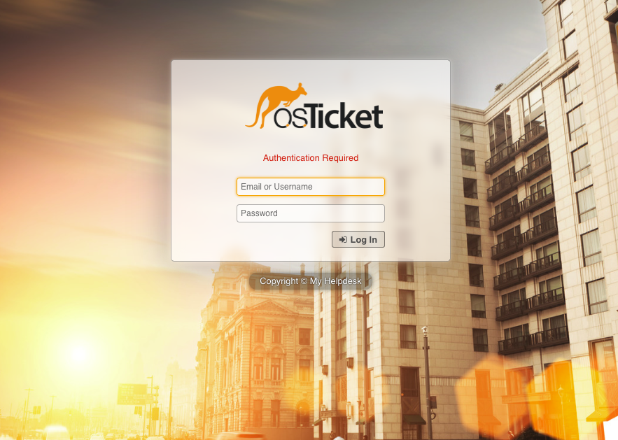
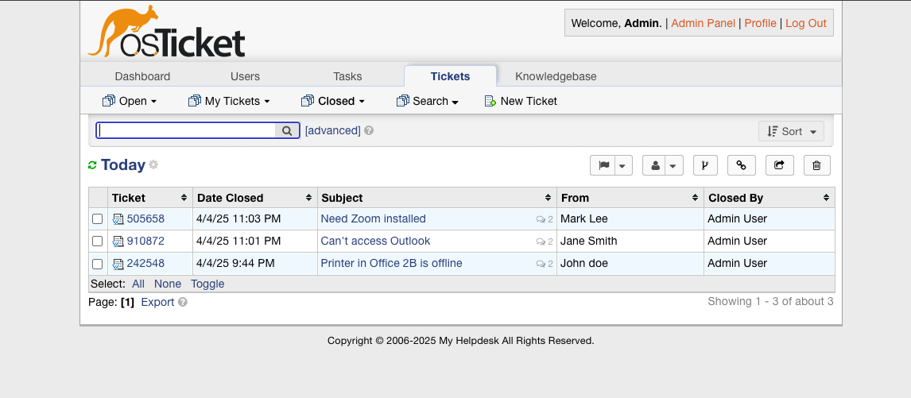
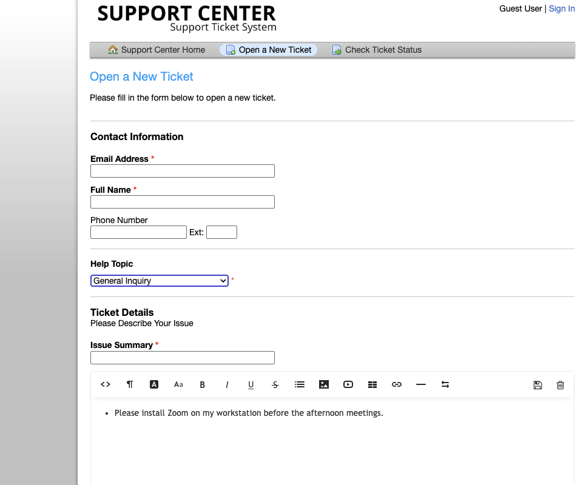
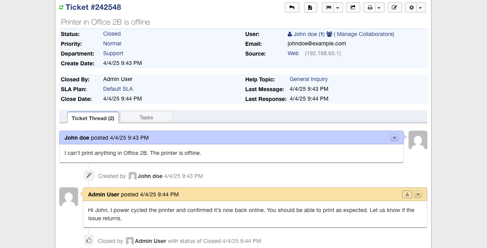

# 🛠️ osTicket Helpdesk Lab (Pre-Configured + Docker)

This is a ready-to-go osTicket deployment lab with:

- ✅ Admin account (admin / admin123)
- ✅ Practice tickets to simulate real-world support
- ✅ Dockerized setup (MySQL + osTicket)
- ✅ Screenshots for GitHub/portfolio

---

## 🚀 Quick Start

1. Rename `.env.example` to `.env`
2. Run:
   ```bash
   docker-compose up -d
   ```
3. Visit:  
   - End User Portal → [http://localhost:8080](http://localhost:8080)  
   - Admin Panel → [http://localhost:8080/scp](http://localhost:8080/scp)  
   - Login → `admin / admin123`

---

## 🎫 Practice Tickets

These tickets are great to recreate manually to simulate helpdesk workflows:

### Ticket 1: Printer Not Working  
**From:** John Doe  
**Subject:** Printer in Office 2B is offline  
**Priority:** Medium  
**Resolution:** Unplugged, plugged back in, verified printing

### Ticket 2: Password Reset Request  
**From:** Jane Smith  
**Subject:** Can't access Outlook  
**Priority:** High  
**Resolution:** Password reset, user confirmed login

### Ticket 3: Software Install Request  
**From:** Mark Lee  
**Subject:** Need Zoom installed  
**Priority:** Low  
**Resolution:** Installed Zoom and tested audio

---

## 📸 Screenshots

> Add your own screenshots to the `screenshots/` folder for portfolio use.

- 
- 
- 
- 

---

## 🧰 Folder Structure

- `docker-compose.yml`
- `.env.example` (rename to `.env`)
- `README.md`
- `screenshots/` (drop in your .pngs for GitHub)
